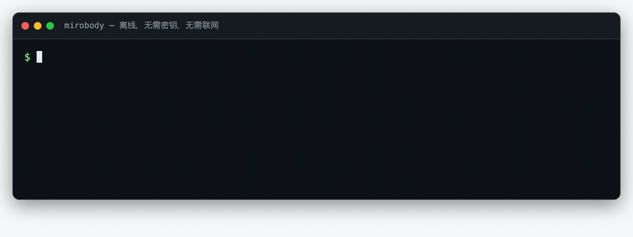
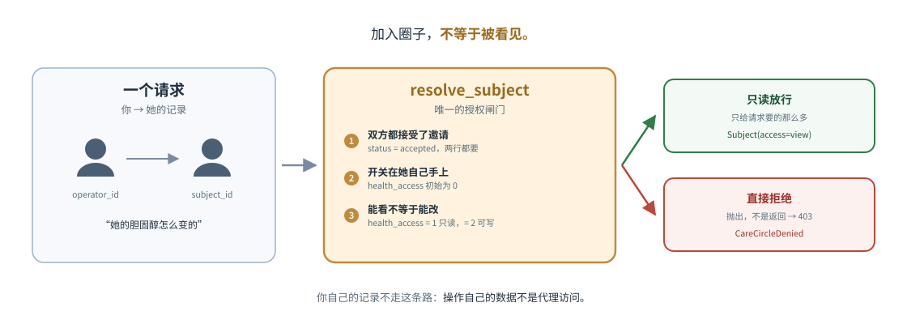
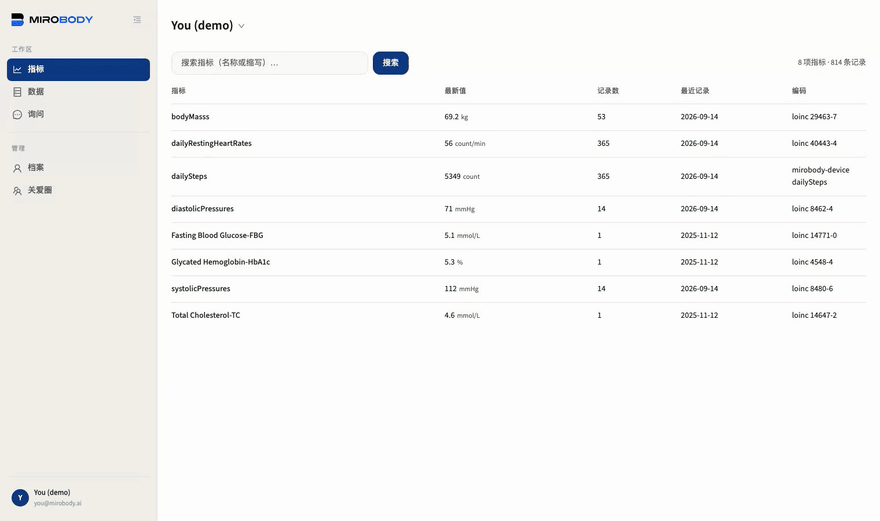
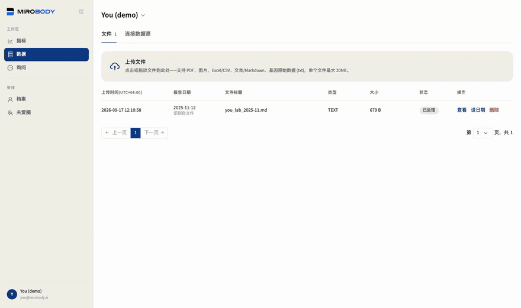
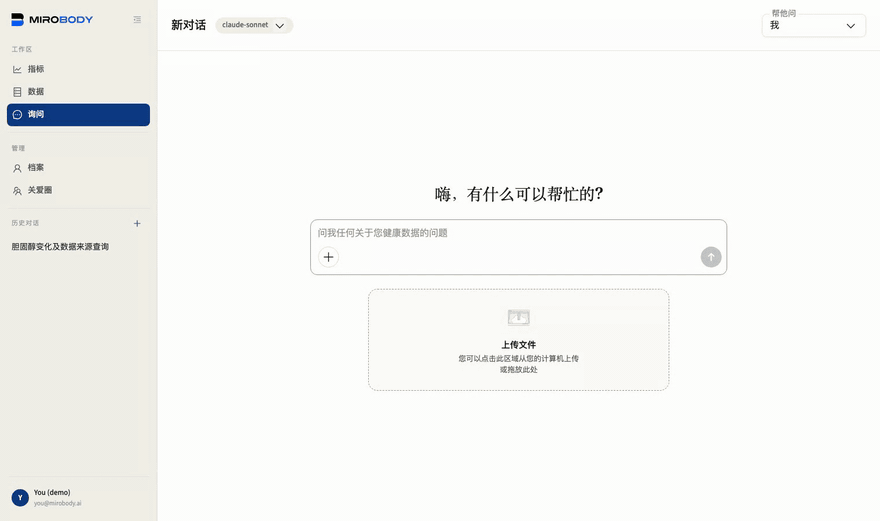

<div align="center">

# Mirobody

**AI 原生的健康数据引擎 —— 收集 · 转译 · 智能体（Collect · Translate · Agent）。**

一份报告写"谷丙转氨酶"，另一份写"ALT"，第三份写"丙氨酸氨基转移酶"——同一项指标，换一家
医院就换一种写法，单位也未必一致。Mirobody 把体检报告、穿戴设备和基因数据都落到同一套
编码上：LOINC 编码、UCUM 单位、FHIR 就绪，AI 才谈得上真读懂。解析器离线可用；引擎驱动着
已上线的消费级健康产品 **[Theta Wellness](https://www.thetahealth.ai/)**——注册用户
5,000+，日活 500+。

**[English](README.md)** · **中文**

[](LICENSE)
[](pyproject.toml)
[](https://pepy.tech/projects/mirobody)
[](https://huggingface.co/mirobody)
[](https://arxiv.org/abs/2604.02834)
[](https://docs.mirobody.ai/)
[](https://github.com/thetahealth/mirobody/stargazers)

**[📚 文档](https://docs.mirobody.ai/zh/)** · **[▶ 在线演示（无需注册）](https://chat.mirobody.ai/demo)** · **[🔌 API 平台](https://platform.mirobody.ai/)**

</div>

## ⚡ 60 秒试一下

不需要 key、不需要配置、不需要联网——用 `uvx` 的话连装都不用装：

```bash
uvx mirobody resolve "LDL cholesterol" 血红蛋白 ヘモグロビン "空腹血糖(GLU)" 血脂
```

<sub>想把它装到 PATH 上就用 `pip install mirobody`。两种方式解析器读的都是随包分发的词表。</sub>

<p align="center">
  
</p>

`血红蛋白`、`ヘモグロビン`、`hemoglobin` 落到同一个码 LOINC `718-7`，`空腹血糖(GLU)`
落到空腹血糖。`血脂` 是一类检查的统称，不是某一项具体检验，所以解析器宁可留空，也不给一个
看着像回事的错码。

```python
from mirobody.engine import resolve, resolve_reading

resolve("血红蛋白").loinc                                # '718-7'   任何语言，同一个码
resolve("total cholesterol").loinc                     # '2093-3'  [Mass/volume]
resolve_reading("total cholesterol", "5.0", "mmol/L")   # '14647-2' [Moles/volume]
resolve_reading("total cholesterol", "193", "mg/dL")    # '2093-3'  单位决定码

resolve("中性粒细胞百分比").loinc                          # '26511-6' 中性粒细胞/白细胞
resolve_reading("中性粒细胞", "62 %", None).loinc          # '26511-6' 百分比……
resolve_reading("中性粒细胞", "4.2", "10*9/L").loinc       # '26499-4' ……和计数是两个码
resolve("血脂").resolved                                 # False    类别，不是观测项
```

**有数值和单位就一起传。** LOINC 把单位和结果类型编进了标识本身，同一个名字
会因单位不同而落到不同的码。`resolve` 宁可留空也不猜：空码是一个值得再看一眼的缺口，
`method="refused"` 则是一个明确的决定。
→ [引擎参考](https://docs.mirobody.ai/zh/engine/) · [指标](https://docs.mirobody.ai/zh/concepts/indicators/)

## 为什么是 Mirobody

- **一个人的报告攒在好几家医院，写法各是各的。** 这是健康数据的第一道坎，不迈过去，
  后面的分析都建在沙子上。Mirobody 把任何语言的任何读数转译成 LOINC + UCUM；不认识的
  词就明确留空，不硬凑一个看起来合理的码。
- **AI 读不懂的数据，推理出来的都不作数。** agent 读的是原始文件本身，把化验值和传感器
  序列画进同一张图，并告诉你结论出自哪一页。
- **自己托管，用公开标准，Apache-2.0。** `./deploy.sh` 一条命令在自己机器上跑起整套；
  数据以 LOINC 编码、FHIR 就绪的形式留在你手里，想带走随时能带走。同一组工具也通过
  MCP 给 Claude Desktop、Cursor 或你自己的 agent 用。**不需要 GPU：自己托管的是应用，
  不是模型。** 你只需要一把 API key 接到云端模型，本机不跑推理。这里说的"离线"指的是
  解析器——名称到编码，不联网、不用 key——不是在本地跑大模型。

## 收集 · 转译 · 智能体

<p align="center">
  
</p>

引擎只做三件事，代码库、文档和[贡献指南](#-贡献)都严格按这三个阶段组织：

| 阶段 | 含义 | 位置 |
| --- | --- | --- |
| **① 收集 Collect** | 接入数据：3 个设备数据源 · 7 种文件格式 · Apple Health（`mirobody import apple export.zip`，或由已签名的 iOS 客户端推送进来） | [`pulse/`](mirobody/pulse/) |
| **② 转译 Translate**（standardize） | 归到一套标准：任意写法的读数解析成标准编码（LOINC · SNOMED CT · RxNorm），单位统一成 UCUM，用的都是 FHIR 认可的编码体系 | [`indicator/`](mirobody/indicator/) |
| **③ 智能体 Agent** | 拿来推理：agent 通过虚拟文件系统读*原始文件*，作答时给图，也给出处 | [`agent/`](mirobody/agent/) |

## 用数字说话

| | |
| --- | --- |
| 概念图谱 | 440,961 个节点 · 22,044,110 条跨词表边 · 595,746 个来源 ID，归并成一套标准概念（LOINC · SNOMED CT · RxNorm 互通） |
| 别名 | 49,253 条多语言别名（中文 22,578 · 日本語 16,809 · 另有 de·es·fr·ko·ru）；`hemoglobin`、`血红蛋白`、`血紅素`、`ヘモグロビン` 都落到 718-7 |
| 繁体中文 | 内置 3,336 字的繁→简折叠表，加上按繁体拼写单独维护的词条——人工词条永远优先于折叠 |
| 单位 | 约 310 个 UCUM 单位族，带量纲分析和按 LOINC 码索引的摩尔质量桥；305 个标准 pulse 指标 |
| 覆盖率 | **213/213**：一份普通体检会印出来的各类面板，按报告的原始写法，覆盖英文、中文（简繁）和日文（[`test_engine_coverage.py`](mirobody/tests/test_engine_coverage.py)） |
| 词表版本 | LOINC 2.82：`mirobody.BUNDLE_VERSION` → `loinc-2.82+2026.08.28-af2524b7a285`——版本号、切割日期和词表成员的摘要 |
| 安装体积 | `pip install mirobody` 只有 **2 个包**，仅依赖 numpy —— macOS 上约 52 MB，Linux 上约 100 MB（numpy 在那边自带一份 BLAS） |

为什么停在 2.82 没有升 2.83、LOINC 在穿戴指标上覆盖到哪里、以及那个默认不开、开了就不留空的
语义层：→ [标准化详解](docs/standardization.md)

## 📊 基准——公开、可独立复现

Hugging Face 上同类下载量最高的健康 AI 基准，每个月各 4,000+ 次下载：
[ESL-Bench](https://huggingface.co/datasets/mirobody/ESL-Bench)（事件驱动的纵向健康
agent 评测——100 个合成用户、10,000 个问题，[arXiv:2604.02834](https://arxiv.org/abs/2604.02834)）·
[MedHall-Bench](https://huggingface.co/datasets/mirobody/MedHall-Bench)（医学幻觉）·
[MedHarm-Bench](https://huggingface.co/datasets/mirobody/MedHarm-Bench)（有害医疗建议）。
用 **[mirobody-eval](https://github.com/thetahealth/mirobody-eval)** 一条命令复现任何一个，
它还能给部署注入合成的、不含 PHI 的轨迹数据。

## 🚀 跑起整套系统

```bash
git clone --depth 1 https://github.com/thetahealth/mirobody.git && cd mirobody
git lfs install && git lfs pull   # 解析器的 LOINC 数据包；不执行的话新克隆里只有 LFS 指针
./deploy.sh                       # Postgres + pgvector、Redis、服务、worker → http://localhost:18060
```

用 `--depth 1` 是因为历史里大半是已被取代的前端构建产物，你多半不需要：克隆体积
从约 125 MB 降到约 99 MB（2026-09-14 实测；剩下的大头是 LFS 词表包，两种克隆都得下）。打算提 PR 的话去掉这个参数。`./deploy.sh` 还会取回语义
指标检索所需的 22 MB 概念图谱——它是 release 附件而不是仓库文件，见
[`mirobody/res/EXTERNAL.tsv`](mirobody/res/EXTERNAL.tsv)。

用 `caregiver@mirobody.ai`、验证码 `111111` 登录。不需要邮件服务：登录页默认是密码登录，
一条请求就能创建你自己的账号：

```bash
curl -X POST localhost:18060/password/register -H 'Content-Type: application/json' \
     -d '{"email":"you@example.com","password":"at-least-8-chars"}'
```

**你的关爱圈。** 账号名就写明了身份：你是以照护者的身份登录的，读到的记录属于另一个人。
共享以圈子为单位，但记录始终是各人自己的——看不看得见，由记录的主人在自己那一行上说了算。

<div align="center">

</div>

`SEED_DEMO_DATA` 默认开启，所以圈子一开始就不是空的：你名下有一份**薄**记录——数周的
自测体征和一次结果正常的年度体检——同时一位合成人物向你共享了一份**厚**记录：
**Demo (synthetic)**，两年跨度、**244 个指标、14,273 条读数**、五份 agent 能读的文件。
同一个问题，两份记录：问*你自己*的糖化血红蛋白，答案是你名下一条平平无奇的正常值；
问*她*的，答案来自一份你只有查看权限的两年记录。下面的录屏把两边都走了一遍：先是你
自己的指标和文件，再切到她共享的记录，打开两年的糖化血红蛋白：

<p align="center">
  
</p>

图里那个开关是一个数据库列，不是一句承诺：`care_circle_members.health_access`，
`NOT NULL DEFAULT 0`，落在**你自己**那一行上。被邀请进圈子不共享任何东西——由成员自己决定，
别人的任何操作都抬不高它。忘了检查的路由会回 403，而不是把记录交出去。
[`examples/06_care_circle_rules.py`](examples/06_care_circle_rules.py) 能离线打印整张决策表。
要保存真实数据时，设 `SEED_DEMO_DATA=false`。

**一把 key 就够。** 看种子记录不用 key，上传和提问要一把。把它写进 `compose.yaml`
旁边的 `.env`，再 `docker compose restart`——容器读的是 `/app/.env`，在 shell 里
`export` 传不进去。key 只存在于 `.env`：`config.llm.yaml` 里写的是变量名
（`api_key: OPENROUTER_API_KEY`），不是密钥本身。

**一把 key 跑通全部，而且和你的硬件无关**：本机不跑模型、不需要 GPU，key 指向的是云端。
哪一把都行：[OpenRouter](https://openrouter.ai/keys)（`OPENROUTER_API_KEY`，推荐）、
DashScope、Google、[OpenAI](https://platform.openai.com/api-keys)（`OPENAI_API_KEY`）、
[Anthropic](https://platform.claude.com/settings/keys)（`ANTHROPIC_API_KEY`）、DeepSeek，
任选其一都能跑通全链路——openrouter.ai 在你的网络里不可达，就换一把能达的。

聊天用哪个模型、报告照片交给谁读、指标用谁抽、向量用谁算，四个决定都是
[`config.llm.yaml`](config.llm.yaml) 里的一行，看得见也改得动；自建网关在 `.env` 里加一行
`<PREFIX>_BASE_URL` 就指过去了。启动日志和 `mirobody doctor` 会把每一环选到了什么列出来，
缺什么直接告诉你怎么补。

**① 收集 + ② 转译。** 把 [`demo/lab_report_2025-10-15.pdf`](demo/lab_report_2025-10-15.pdf)
拖到 Data 页，十二个分析物连同数值和单位被抽出来，每一个都链回它所在的那一页：

<p align="center">
  
</p>

**③ 智能体。** 问她的糖化血红蛋白，agent 自己找到数据，把三次化验值和 104 个传感器
估算值画在一起，然后直说：那次改善没有保持住。再问一遍你刚上传的那份报告，它读的就换成
那一份——这是[四分钟完整演示](docs/walkthrough.md)的第四幕。

<p align="center">
  
</p>

→ [Docker 部署](https://docs.mirobody.ai/zh/deployment/docker/) ·
[配置](https://docs.mirobody.ai/zh/configuration/) ·
[本地 Python 环境](https://docs.mirobody.ai/zh/development/setup/)

## 🔌 用它，扩展它

| 你想要 | 这样做 | 文档 |
| --- | --- | --- |
| 在自己的代码里离线解析与换算单位 | `pip install mirobody`——2 个包，无 key，无网络 | [引擎](https://docs.mirobody.ai/zh/engine/) |
| 把一份文件变成读数 | `pip install 'mirobody[parse]'`——PDF、图片、Excel、Word、PowerPoint、文本；只有扫描页才会送到视觉模型 | [引擎](https://docs.mirobody.ai/zh/engine/) |
| 把 agent 框架当库用 | `pip install 'mirobody[agent]'`——中间件、虚拟文件系统后端、checkpointer | [接入你自己的 agent](CONTRIBUTING.md#-bringing-your-own-agent) |
| 在 Claude Desktop、Cursor 或你自己的循环里用这些工具 | 设置 → MCP：每个 agent 工具同时通过 `/mcp` 提供，按用户鉴权 | [MCP 服务](https://docs.mirobody.ai/zh/api-reference/mcp-servers/) · [`examples/07_claude_agent_sdk.py`](examples/07_claude_agent_sdk.py) |
| 你的应用对接一个部署 | HTTP API，或 backbone 模式：你的 agent，我们的数据层 | [API 概览](https://docs.mirobody.ai/zh/api-reference/overview/) · [Backbone](https://docs.mirobody.ai/zh/api-reference/backbone-mode/) |
| 新工具、新技能或新设备接入 | 把文件放进 `mirobody/agent/tools/`、`mirobody/agent/skills/` 或 `mirobody/pulse/providers/` 然后重启——或者 `pip install` 一个声明了 `mirobody.providers` / `mirobody.tools` / `mirobody.agents` 入口点的包 | [添加工具](https://docs.mirobody.ai/zh/tools/adding-tools/) · [技能](https://docs.mirobody.ai/zh/tools/skills/) · [提供者](https://docs.mirobody.ai/zh/development/provider-integration/) |
| 换掉整个 agent | `AGENT_DIRS` → 你的目录替换内置 agent | [`mirobody/agent/README.md`](mirobody/agent/README.md) |
| 构建期拿 LOINC 轴表和别名来源 | `mirobody.bundle`——用来生成种子或语料 | [`mirobody/bundle.py`](mirobody/bundle.py) |

## 🤝 贡献

最值钱的一次贡献，是报一个解析错了的词。跑一下 `mirobody resolve "<那个词>"`，答案不对或是空的，
就[提个 issue](https://github.com/thetahealth/mirobody/issues/new?template=wrong-term.yml)；
想直接动手，就往 [`resolver_overrides.tsv`](mirobody/res/resolver_overrides.tsv) 加一行、往
[`test_engine_coverage.py`](mirobody/tests/test_engine_coverage.py) 加一个用例——过不过，覆盖率分数说了算。

```bash
pip install -e '.[test]' && pytest -q && lint-imports
```

→ [CONTRIBUTING.md](CONTRIBUTING.md) · [贡献指南](https://docs.mirobody.ai/zh/development/contributing/) ·
[仓库结构](docs/repository-layout.md) · [路线图](docs/roadmap.md) · [CHANGELOG](CHANGELOG.md) · [SECURITY](SECURITY.md)

## 📚 文档

**[docs.mirobody.ai](https://docs.mirobody.ai/zh/)**，中英双语——从[快速开始](https://docs.mirobody.ai/zh/quickstart/)进入，
或直接看 [API 参考](https://docs.mirobody.ai/zh/api-reference/)。面向贡献者的长篇指南在 [`docs/`](docs/README.md)。

## 🙏 致谢

塑造了内核规则的项目——这里不包含它们的任何代码：
[Open Wearables](https://github.com/the-momentum/open-wearables)（`kernel/series` 与 `kernel/quality` 所封堵的那些数据标准化失效模式）、
[Home Assistant](https://github.com/home-assistant/core)（`state_class`）、
[Open mHealth](https://github.com/openmhealth/schemas) / IEEE 1752（字段命名）、
[wearipedia](https://github.com/Stanford-Health/wearipedia)（合成设备数据）、
[dlt](https://github.com/dlt-hub/dlt) / [Airbyte](https://github.com/airbytehq/airbyte-python-cdk) / [Singer](https://github.com/meltano/sdk)（连接器形态）、
[deepagents](https://github.com/langchain-ai/deepagents)、LangChain 与 [langchain-quickjs](https://github.com/langchain-ai/langchain-quickjs)（agent 框架、文件系统投影、`eval` REPL）、
Regenstrief Institute（LOINC）、UCUM、HL7 FHIR、OHDSI OMOP——见 `LICENSE-3RD-PARTY`。

## ⭐ Star 历史

<div align="center">
<a href="https://www.star-history.com/#thetahealth/mirobody&Date">
  <picture>
    <source media="(prefers-color-scheme: dark)" srcset="https://api.star-history.com/svg?repos=thetahealth/mirobody&type=Date&theme=dark" />
    <source media="(prefers-color-scheme: light)" srcset="https://api.star-history.com/svg?repos=thetahealth/mirobody&type=Date" />
    
  </picture>
</a>

*如果它帮你读懂了一份报告，一个 star 能让下一个人找到它。
基本每周都有发版——[Watch](https://github.com/thetahealth/mirobody/subscription) 就能收到。*

**[📚 文档](https://docs.mirobody.ai/zh/)** · **[▶ 演示](https://chat.mirobody.ai/demo)** · **[🔌 平台](https://platform.mirobody.ai/)** · **[🧪 评测](https://github.com/thetahealth/mirobody-eval)**

Apache 2.0 · © 2026 [Theta Health](https://thetahealth.ai)

</div>
