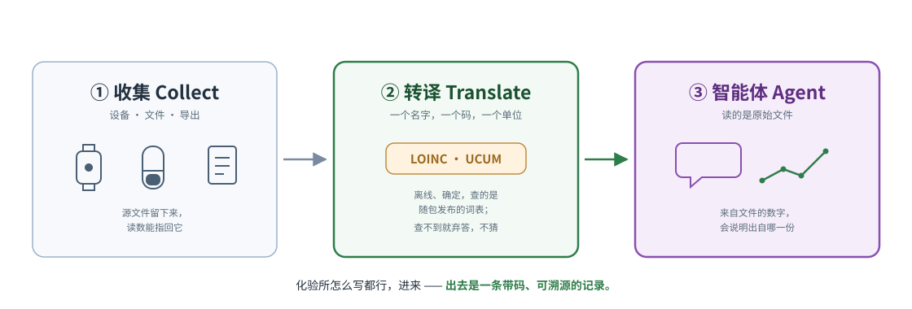

# 标准化详解

**[English](standardization.md)** · **中文**

README 里 **② 转译 Translate（标准化）** 那一阶段的长版本：随包发布的词表到底是
什么、它刻意不做什么、切自哪个 LOINC 版本、为什么停在那里，以及那个默认关闭的
语义层。这里每一个精确数字都和 README 引用的是同一个，而 README 里的数字由它们
来源的产物守着，这一页跟着它走。

<p align="center">
<picture>
  <source media="(prefers-color-scheme: dark)" srcset="images/collect-translate-agent-dark.zh-CN.svg">
  <source media="(prefers-color-scheme: light)" srcset="images/collect-translate-agent.zh-CN.svg">
  
</picture>
</p>

## 这一层提供什么

这里说的标准化不是一张查找表，而是一套完整的术语归一系统：

- **概念图**：440,961 个节点 · 22,044,110 条跨词表边 · **595,746 个来源 id**
  提炼成规范概念（LOINC · SNOMED CT · RxNorm 三者之间的桥接）。
- **49,253 条多语言别名**（中文 22,578 · 日本語 16,809 · 另有 5 种：
  de·es·fr·ko·ru）。`hemoglobin`、`血红蛋白`、`血紅素`、`ヘモグロビン` 全都落在
  LOINC 718-7 上。
- **繁體中文 是两个问题，也就当两个问题处理。** 字形折叠是机械的（随包发布一张
  3,336 字的 zh-Hant → zh-Hans 对照表）；用词不是：台湾的习惯用词不一样，`血紅素`
  折叠过去会撞上 HbA1c 的码。这类词按繁体写法单独收录，而人工收录的那一行永远压
  过折叠的结果。
- **单位**归一到 326 个 UCUM 家族，带量纲分析，有一座按 LOINC 码索引的摩尔质量
  桥，并且对 `%` 和 `10*9/L` 这种情况明确拒绝混算。305 项标准 pulse 指标。
- **还有第二层，而且一直默认关闭。** 上面这些全是词法的，所以遇到不认识的词它会
  弃答，这是一个诚实的天花板。余弦召回
  （[`indicator/semantic.py`](../mirobody/indicator/semantic.py)）能越过这个天花板，
  但它**不会弃答**：碰到从没见过的词，它会用「答对了」的那种置信度把最近邻交给
  你，而且没有任何阈值能把这两种情况分开。**我们不发布矩阵，也不提供下载**：它是
  108,248 行 LOINC × 1024 维（约 221 MB），而且只对某一对（供应商，模型）有效，所
  以 `scripts/build_loinc_embeddings.py` 用你自己配的 embedding 模型给你建一份。
  换个模型建出来的矩阵不会报错，它会在错误的空间里自信地排序，所以构建时会写
  `<matrix>.meta.json`，加载时对不上就拒绝。在你把 `MIROBODY_SEMANTIC_INDEX` 指过
  去之前，`resolve()` 的行为一点不变；指过去之后，也只拿它来**建议**一个由人确认
  的码，绝不用它凭空定身份。
  → [语义召回](https://docs.mirobody.ai/zh/concepts/semantic-recall/)：基准、两道
  轴门禁，以及为什么 `min_score` 不是一个正确性阈值。
- **我们量这个说法，而不是断言它。**
  [`test_engine_coverage.py`](../mirobody/tests/test_engine_coverage.py) 拿常规体检
  会出现的那些套餐去考离线解析器，词按报告上真正的印法写，覆盖英文、简体中文、
  繁體中文和日本語，外加平台 API 教给我们的那套穿戴设备词汇。**今天是 213/213；
  刚写出来那天是 32/94。** 它判的是**临床**正确：把 `血红蛋白` 答成 HbA1c 的码算
  错，`血脂` 则必须解析不出结果。

```bash
pytest mirobody/tests/test_engine_coverage.py -s   # 离线，大约一秒
```

### 两个语义索引，以及哪一个是白送的

上面那个矩阵属于**可下载语料**那一层：LOINC 的行被嵌入一次，由你用自己的 embedding
模型建。部署里还有第二个索引，和它毫无关系，而且是白送的：应用内的指标搜索嵌入的
是**你自己的指标名**，不是 LOINC 语料。worker 的 `IndicatorSyncTask` 会在每次入库
时写 `th_series_dim.embedding_qwen3_8b`，查询就是拿它来匹配的。它需要
`mirobody worker` 在跑（`./deploy.sh` 会起），以及一个 embedding 供应商：可以是跑
聊天的那把 OpenAI 兼容 key，也可以是任何挂在 `/v1/embeddings` 后面、通过
`<PROVIDER>_BASE_URL` 指过去的自托管模型。这两个索引都不改变 `resolve()` 的答案。

### 切的是哪个 LOINC，覆盖了什么，没覆盖什么

随包发布的词表切自 **LOINC 2.82**，而且这件事由包在运行时自己说，不是写在一句会
过期的注释里：

```python
>>> import mirobody; mirobody.BUNDLE_VERSION
'loinc-2.82+2026.08.28-af2524b7a285'
```

发行版本、切分日期，加一份对词表自身成员算出来的摘要，于是「构建期用的词表」和
「运行时 `pip` 钉住的那个」可以被断言为同一份语料，而光看包版本号你永远不知道这
一点。[LOINC 的许可](https://loinc.org/license/)要求每一份拷贝都带版本号；
`res/fhir_loinc_bundle.NOTICE` 带了，`scripts/stamp_bundle_version.py --check`
负责让这个戳保持诚实。

**为什么是 2.82 而不是 2.83。** 轴表和那份 677k 行的语料是通过折叠后的
`LONG_COMMON_NAME` 耦合在一起的，而 2.83 改名了其中 2,842 个
（`Cerebral spinal fluid` → `Cerebrospinal Fluid` 那一族）。实测：只升轴表会丢掉
**3,486** 条「名字→码」的链接，一条也换不回来，所以真正的升级意味着重建语料，而语
料跨了 SNOMED CT、RxNorm、CVX 和 DCM，各自单独授权，没有一个能在这里再分发。停在
2.82 的已知代价：2.83 标成 DISCOURAGED 或 DEPRECATED 的 650 个码在这里仍然答得出
来，反映到基准上是 6,815 个用例里有 52 个。把它们扣掉也实测过，没有采用：658 个里
LOINC 只给出 9 个替代码，所以扣掉基本上是把一个过时的码变成没有码，而一条没有码的
指标根本没法归组。

**LOINC 覆盖的穿戴设备世界比大多数人以为的多。** 它不只有化验套餐：`BDYWGT.*` 管
身体成分（`101685-6` 骨量、`73964-9` 肌肉量、`101684-9` 体水分百分比），
`HRTRATE.*` 把静息心率（`40443-4`）和随手一测区分开，还有步数（`41950-7`）、睡眠
分期（`93831-6` 深睡、`93830-8` 浅睡）、HRV SDNN（`112429-6`）、最大摄氧量峰值和
爬升高度的码。它停在哪里：厂商的复合指标。Garmin 的 Body Battery 和压力分数没有
码，这是对的，因为那是一家公司的公式，不是一项测量。

**一个词表覆盖了什么，和我们在它上面的召回率，是两回事**，而这个差距是我们的，不是
LOINC 的：`Body bone mass` 在这里能解析到 `101685-6`，但中文的 `骨量` 会解析到一个
牙科体积的码，因为没有别名把它路由过去。
[`res/resolver_overrides.tsv`](../mirobody/res/resolver_overrides.tsv) 就是干这个用
的：人写下的一行，永远压过索引里的一次表层匹配。

→ [loinc.org](https://loinc.org/) · [许可](https://loinc.org/license/) ·
[发布说明](https://loinc.org/kb/)。下载免费，但需要注册账号，这也是为什么这里发布
的是派生词表，而不是源发行版。

→ [标准化](https://docs.mirobody.ai/zh/api-reference/standardization/) ·
[架构](https://docs.mirobody.ai/zh/concepts/architecture/) ·
[数据流](https://docs.mirobody.ai/zh/concepts/data-flow/)
