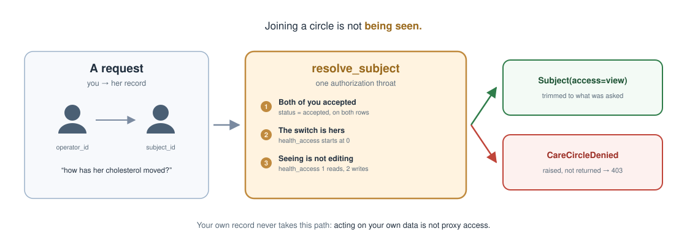
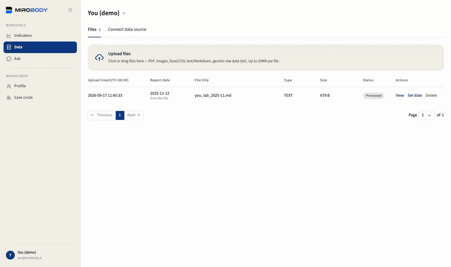
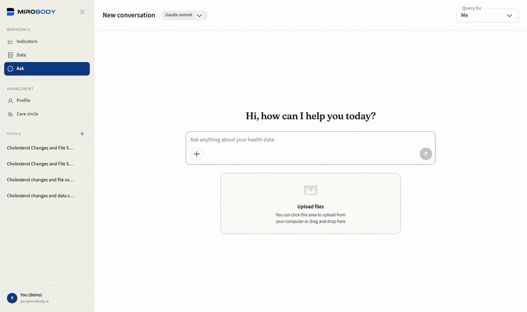
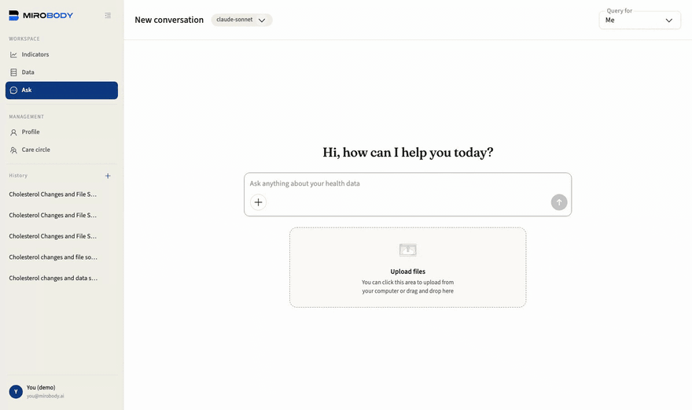

# The whole engine, in four minutes

**English** · **[中文](walkthrough.zh-CN.md)**

The care-circle walkthrough the README used to carry in full. Parts 2 to 4 are
recorded against a running `./deploy.sh` stack with `SEED_DEMO_DATA` on; part 1
is drawn, because what it shows is the authorization path and a drawing of that
can be checked against `user/care_circle.py` while a recording cannot. The
README carries three of the four scenes and links here for the fourth.


`SEED_DEMO_DATA` defaults to on, so the ① → ② → ③ chain is walkable the moment
`./deploy.sh` finishes — signing in and browsing the seeded record need no key;
the extraction in parts 2 and 3 and the questions in part 4 ride the one key
configured above.

**1 · Arrive.** You sign in as `you@mirobody.ai` and find two records, not one.
Yours: a year of self-tracked vitals and a lab panel from last November.
`mom@mirobody.ai` has the same shape and is a different person, sharing their
record with you view-only, and their weight is climbing, their nights are short
and their HbA1c has crossed out of range. Same question, two answers, and only
one of the two records is yours. Isolation you can see, not just read about.

<p align="center">
  <picture>
    <source media="(prefers-color-scheme: dark)" srcset="images/your-care-circle-dark.svg">
    <source media="(prefers-color-scheme: light)" srcset="images/your-care-circle.svg">
    
  </picture>
</p>

<a id="the-four-promises"></a>

| The circle promises | Enforced by |
| --- | --- |
| Acceptance is required to join | `status`, and pending is not accepted |
| Health data stays off until you allow it | `health_access`, `NOT NULL DEFAULT 0` |
| It is **your** switch, on **your own** row | it governs your record, not theirs |
| Each member controls their own | no other party's action can raise yours |

These four were a drawing until 1.4.4. Each is pinned by a test as a security
property rather than a nicety, because the shipped code once contradicted all
four at once (see [the roadmap](roadmap.md)). A table can be diffed; a picture
cannot.

The switch is a column, not a promise:
`care_circle_members.health_access`, `NOT NULL DEFAULT 0`, on **your own** row.
Being invited into a circle shares nothing — the member decides, and no other
person's action can raise it. The check that reads it raises rather than
returning a falsy value, so a route that forgets to look answers 403 instead of
handing over a record.
[`examples/06_care_circle_rules.py`](../examples/06_care_circle_rules.py) prints
the whole decision table offline.

**2 · ① Collect.** [`demo/upload/`](../demo/) holds four files the seed
deliberately leaves out, so uploading one is not a no-op — and they are four
different formats, because a health record arrives as whatever the lab, the
clinic and the family actually produce:

| File | Format | What it is | Readings |
| --- | --- | --- | --- |
| `you_annual_checkup_2026-05.pdf` | PDF | this year's panel, printed by the clinic | 9 |
| `mom_physical_2026-06.jpg` | JPG | a phone photo of a printed slip | 9 |
| `you_lipid_panel_2026-08.csv` | CSV | a different lab's export, in its own wording | 5 |
| `mom_clinic_visit_2026-07.xlsx` | XLSX | what the clinic typed into a spreadsheet | 4 |

Drop one on the Data page and the file is stored first, verbatim and traceable.
That is all ① Collect does, and the split matters: what a lab said is one fact,
what it means is another.

<p align="center">
  
</p>

**3 · ② Translate.** Its analytes come out as readings a few seconds later,
each one linking back to the file it was read off, and each one carrying a
code:

```
Glycated Hemoglobin-HbA1c   5.2 %        loinc 4548-4
Fasting Blood Glucose-FBG   4.9 mmol/L   loinc 14771-0
Total Cholesterol-TC        4.45 mmol/L  loinc 14647-2
Low-Density Lipoprotein-LDL 2.48 mmol/L  loinc 22748-8
```

The model reads the page; it does not get to invent the code. Resolution is a
lookup against the shipped bundle, offline and deterministic, and it abstains
rather than guessing when it has no answer.

That code is what lets different files be read together. The csv comes from a
different lab and names its analytes differently — `Cholesterol, Total` where
the panel prints `Total Cholesterol-TC` — and both are 14647-2, so they are one
series and not two. The unit is part of that identity rather than something
smoothed over: cholesterol is 14647-2 in mmol/L and 2093-3 in mg/dL, and saying
so is what stops a trend built from a mix of the two from being silently wrong.
Reconciling those two codes into one comparable line is 1.5.0's comparability
key; on the device side the conversion already happens, and
[`examples/02_standardize_a_reading.py`](../examples/02_standardize_a_reading.py)
turns `154.5 lb` into `70.08 kg` offline.

**4 · ③ Agent.** Ask how the cholesterol has moved. The agent finds every file
that carries it, the csv's other spelling included, and answers from what it
read:

```
Total Cholesterol   4.60 mmol/L   2025-11-12   you_lab_2025-11.md
                    4.45 mmol/L   2026-05-06   2026-05-06_Annual_Physical_Exam_Report.pdf
                    4.38 mmol/L   2026-08-04   you_lipid_panel_2026-08.csv
```

Three files, three vocabularies, one line, and the file each number came off
named beside it. Ask the same question about the shared record and the answer
is a different person's.

<p align="center">
  
</p>

<p align="center">
  
</p>

That is the whole chain in one sitting: a file goes in, a coded reading comes
out, and an agent answers over it — **C · T · A**, each stage visible on its own
rather than asserted.

Every value is generated; no file here describes a person, and the seed needs no
network and no key. Set `SEED_DEMO_DATA=false` for a deployment that will hold
real data. [`demo/README.md`](../demo/README.md) says what each file is and how
to rebuild it; what the extraction pass does *not* yet do with those readings is
in [docs/roadmap.md](roadmap.md) rather than glossed over here.

---

