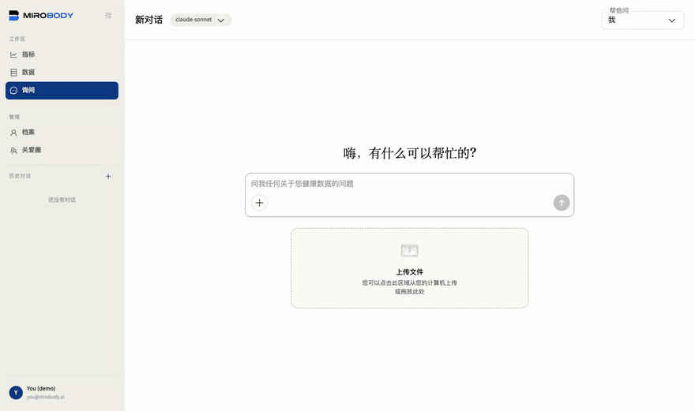

# 四分钟跑完整条引擎

**[English](walkthrough.md)** · **中文**

README 从前完整收录的那份关爱圈演示。每一段都是对着一套跑起来的 `./deploy.sh`、
并且开着 `SEED_DEMO_DATA` 录的；README 放了四幕里的三幕，第四幕链到这里。

`SEED_DEMO_DATA` 默认打开，所以 `./deploy.sh` 一跑完，① → ② → ③ 这条链就能走：登录
和浏览种子记录不需要任何 key；第 2、3 段的抽取和第 4 段的提问，走的是前面配的那一
把 key。四段，每一段都对着跑起来的这套录。

**1 · 进门。** 你用 `you@mirobody.ai` 登录，看到的是两份记录，不是一份。你自己的：
一年的自测体征，加去年 11 月的一份化验单。`mom@mirobody.ai` 的形状一样，但那是另一
个人，把记录以只读方式共享给你，而她的体重在涨、睡眠偏短、HbA1c 已经越出范围。同一
个问题，两个答案，而两份记录里只有一份是你的。隔离是你能看见的，不是只能读到的。

<p align="center">
  
</p>

<a id="the-four-promises"></a>

| 关爱圈的四条承诺 | 由什么保证 |
| --- | --- |
| 必须本人接受才算加入 | `status`，待处理不等于已接受 |
| 健康数据默认不开，除非你允许 | `health_access`，`NOT NULL DEFAULT 0` |
| 这是**你的**开关，在**你自己的**那一行上 | 它管的是你的记录，不是对方的 |
| 每个成员各管各的 | 任何别人的动作都抬不高你的 |

到 1.4.4 之前，这四条只是一张图。现在每一条都由测试当作**安全属性**钉死，而不是当
作一件好事，因为出货的代码曾经一次性违反了全部四条（见[路线图](roadmap.md)）。
表可以 diff，图不行。

这个开关是一个字段，不是一句承诺：`care_circle_members.health_access`，
`NOT NULL DEFAULT 0`，在**你自己的**那一行上。被拉进一个圈子本身不共享任何东西，
由成员自己决定，别人的任何动作都抬不高它。读它的那个检查是抛异常而不是返回一个假
值，所以一条忘了检查的路由给出的是 403，而不是把记录递出去。
[`examples/06_care_circle_rules.py`](../examples/06_care_circle_rules.py) 能离线打印
整张决策表。

**2 · ① 收集。** [`demo/upload/`](../demo/) 里放着四份种子数据故意没写进库的文件，
所以上传一份不是空操作。它们是四种不同的格式，因为一份健康档案本来就是化验所、诊所
和家里各自产出什么样，它就是什么样：

| 文件 | 格式 | 是什么 | 指标数 |
| --- | --- | --- | --- |
| `you_annual_checkup_2026-05.pdf` | PDF | 今年的体检套餐，诊所打印的 | 9 |
| `mom_physical_2026-06.jpg` | JPG | 一张打印单子的手机照片 | 9 |
| `you_lipid_panel_2026-08.csv` | CSV | 另一家化验所的导出，用它自己的写法 | 5 |
| `mom_clinic_visit_2026-07.xlsx` | XLSX | 诊所敲进表格里的那些 | 4 |

把一份拖到 Data 页，文件先被原样存下来，可追溯。① 收集只做这一件事，而这个切分很
要紧：化验所说了什么是一个事实，它是什么意思是另一个。

<p align="center">
  
</p>

**3 · ② 转译。** 几秒之后，里面的分析物变成一条条指标，每一条都链回它被读出来的那
份文件，每一条都带着码：

```
Glycated Hemoglobin-HbA1c   5.2 %        loinc 4548-4
Fasting Blood Glucose-FBG   4.9 mmol/L   loinc 14771-0
Total Cholesterol-TC        4.45 mmol/L  loinc 14647-2
Low-Density Lipoprotein-LDL 2.48 mmol/L  loinc 22748-8
```

模型负责读这一页，但轮不到它去编码。解析是对着随包发布的词表查表，离线、结果确定，
查不到就弃答，不猜。

正是那个码，让不同的文件能放在一起读。那份 csv 来自另一家化验所，分析物的写法也不
一样：套餐上印的是 `Total Cholesterol-TC`，它写的是 `Cholesterol, Total`，而两者同为
14647-2，所以它们是一条序列，不是两条。单位是这个身份的一部分，而不是被抹平的东西：
胆固醇在 mmol/L 下是 14647-2，在 mg/dL 下是 2093-3，把这件事说出来，才挡得住一条由两
者混起来的趋势悄悄地错。把这两个码归并成一条可比的线是 1.5.0 的 comparability key；
设备那一侧的换算已经在做了，
[`examples/02_standardize_a_reading.py`](../examples/02_standardize_a_reading.py)
能离线把 `154.5 lb` 变成 `70.08 kg`。

**4 · ③ 智能体。** 问一句胆固醇怎么变的。agent 会把带着这一项的文件全都找出来，包括
csv 里那个不一样的写法，然后拿它读到的东西作答：

```
Total Cholesterol   4.60 mmol/L   2025-11-12   you_lab_2025-11.md
                    4.45 mmol/L   2026-05-06   2026-05-06_Annual_Physical_Exam_Report.pdf
                    4.38 mmol/L   2026-08-04   you_lipid_panel_2026-08.csv
```

三份文件，三套写法，一条线，每个数字旁边都写着它出自哪一份。同一个问题问到共享的那
份记录上，答案就是另一个人的。

<p align="center">
  
</p>

<p align="center">
  
</p>

这就是一次坐下来跑完的整条链：一份文件进去，一条带码的指标出来，一个 agent 在它上面
作答。**C · T · A**，每一阶段都单独可见，而不是嘴上说说。

所有数值都是生成的，这里没有一份文件描述真实的人，种子数据也不需要联网、不需要 key。
要让一套部署存真实数据，把 `SEED_DEMO_DATA` 设成 `false`。
[`demo/README.md`](../demo/README.md) 说明每份文件是什么、怎么重建；抽取这一步对这些
指标**还没有**做到的事，写在 [docs/roadmap.md](roadmap.md) 里，而不是在这里含糊过去。
